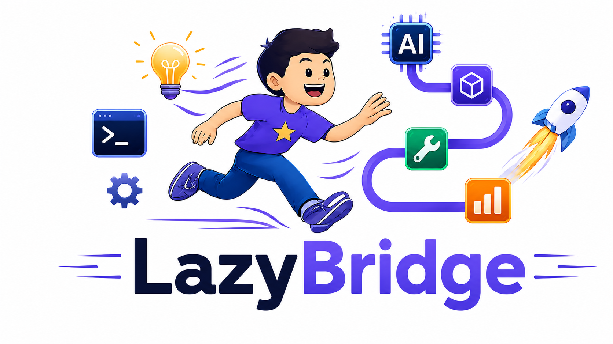
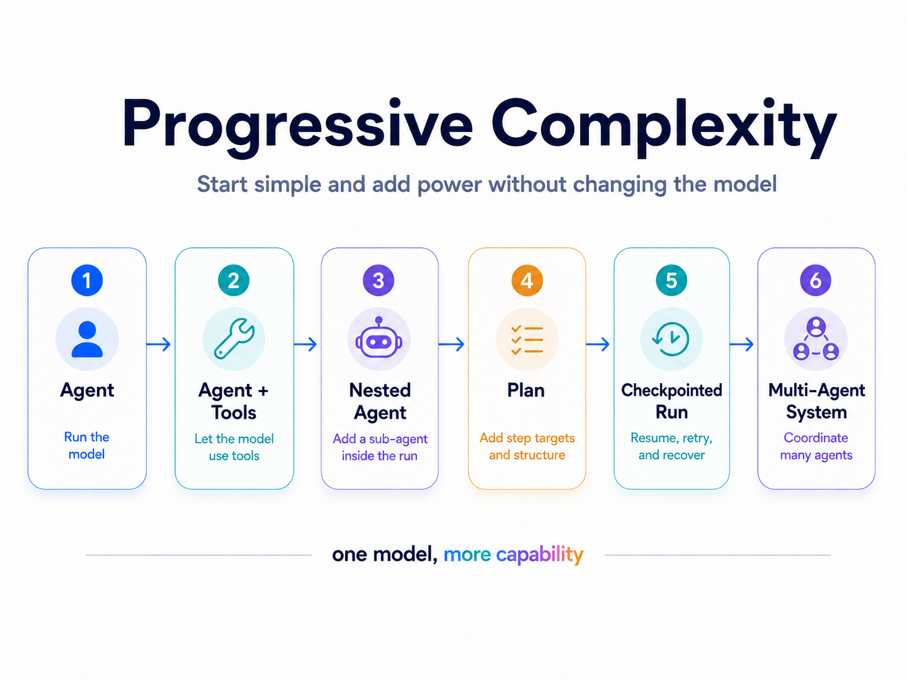
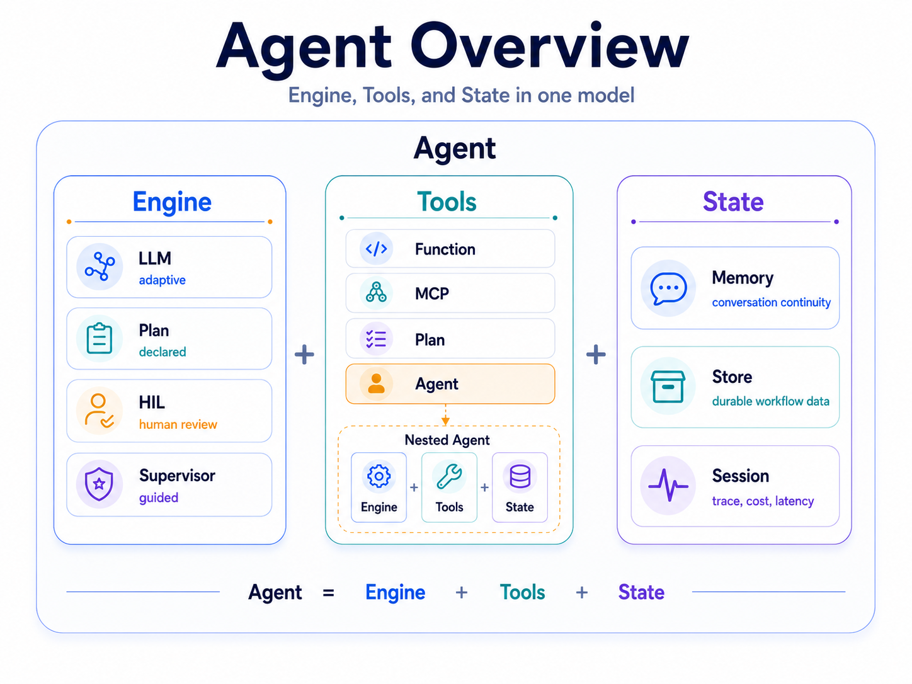
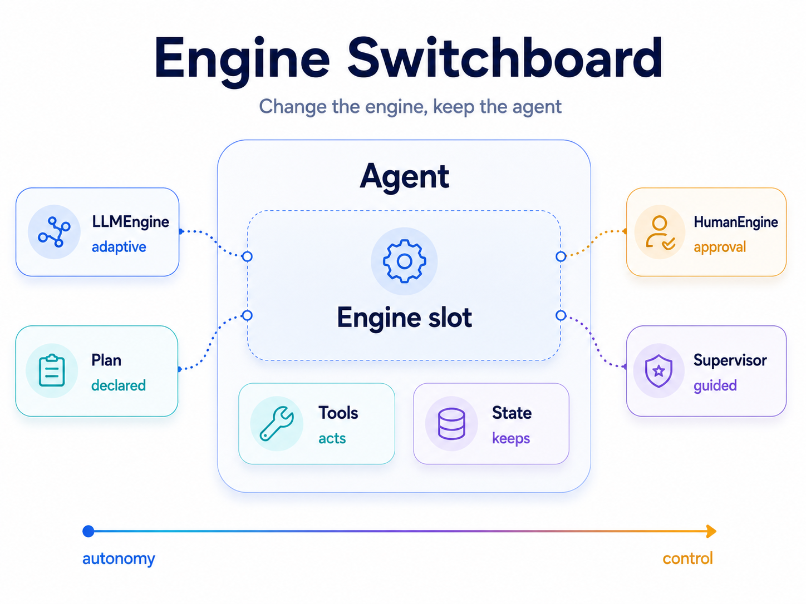
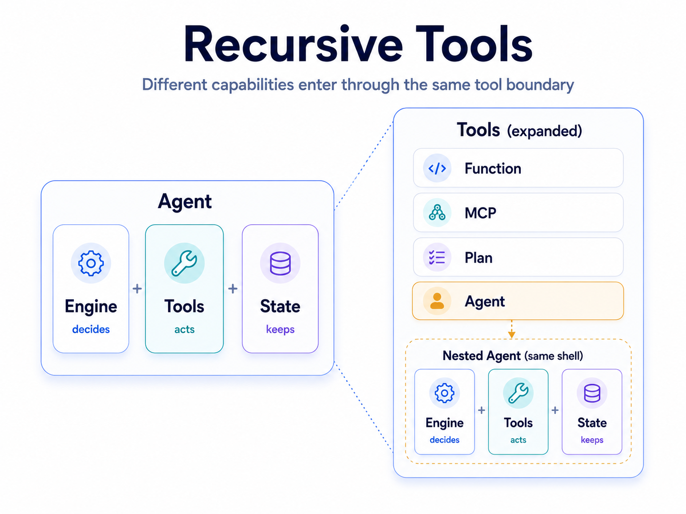
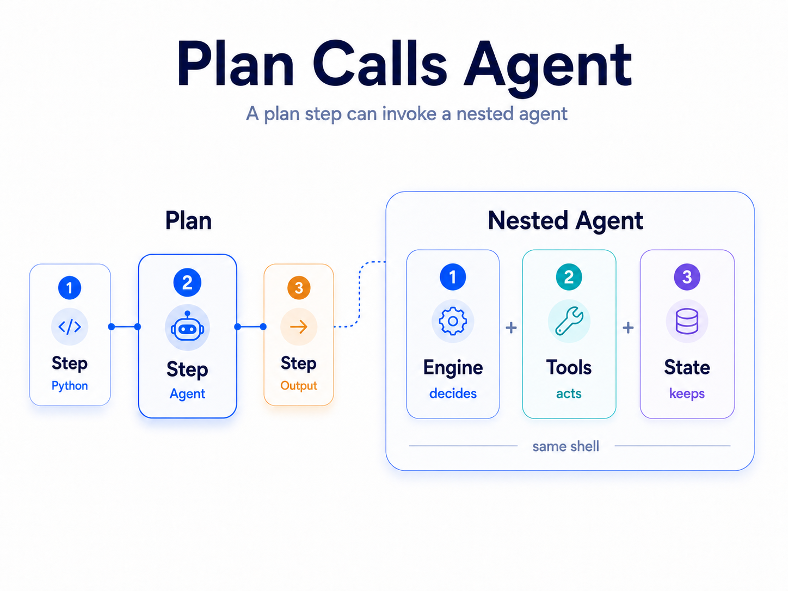
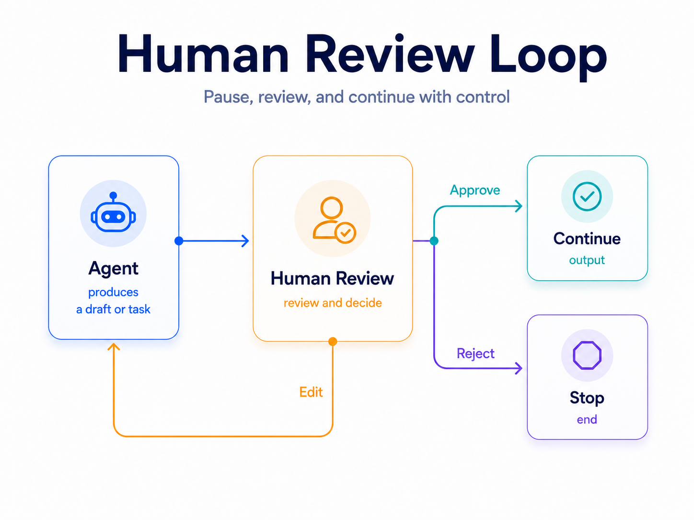
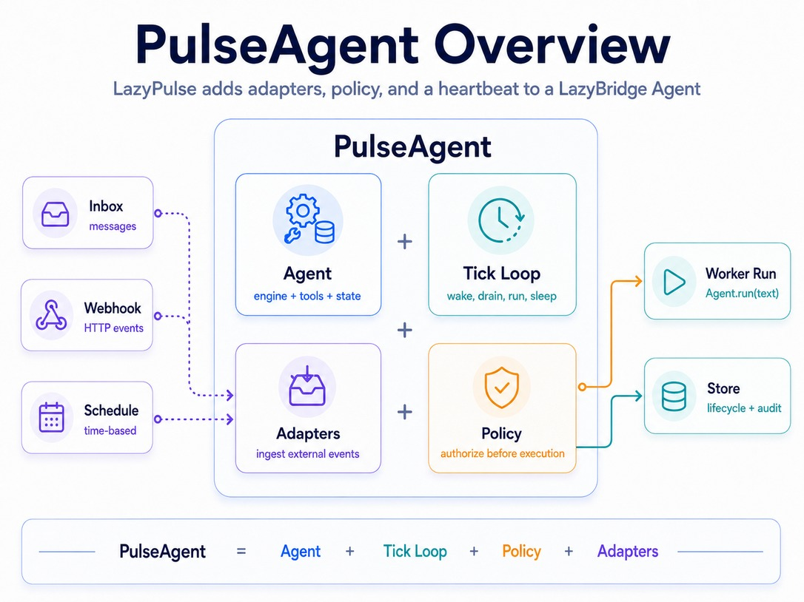
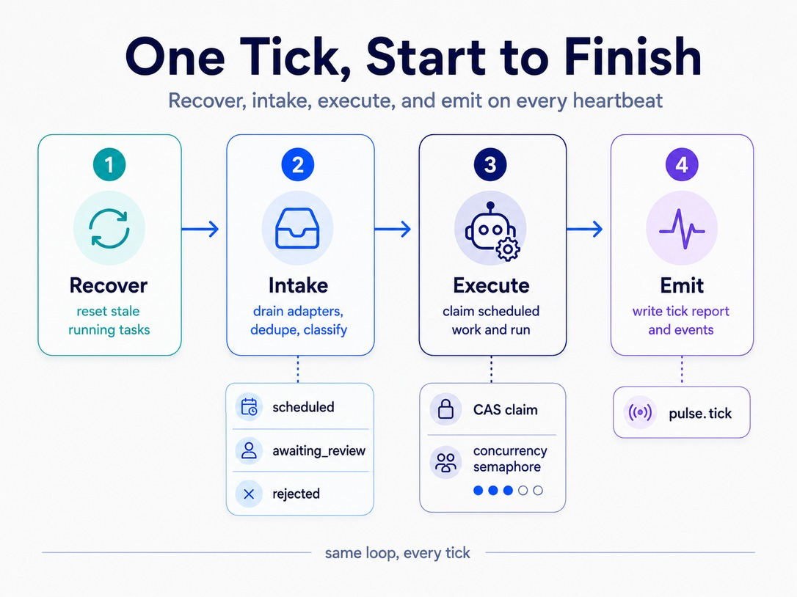
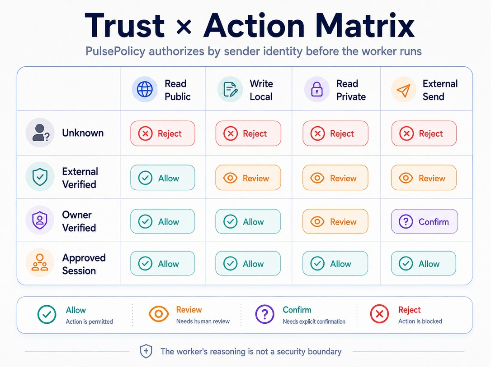

---
hide:
  - navigation
  - toc
title: LazyBridge — Python composition runtime for LLM workflows
description: Build LLM workflows where functions, agents, plans, humans and external systems all compose through one tool interface.
---

<!-- ═══════════════════ HERO ═══════════════════ -->
<section class="lb-hero">
  <div class="lb-hero__copy">
    <div class="lb-pill">Everything is a tool &bull; Python-first &bull; Composition runtime</div>

    <h1>LazyBridge is the Python framework for <span class="accent">composable LLM workflows</span>.</h1>

    <p class="lb-subhead">
      Functions, agents, deterministic plans, humans and external systems
      all compose through one tool interface &mdash; with validation,
      checkpointing and tracing built in.
    </p>

    <div class="lb-cta-row">
      <a href="https://core.lazybridge.com/quickstart/" class="lb-btn lb-btn--primary">Get started &rarr;</a>
      <a href="https://core.lazybridge.com/concepts/layered-composition/" class="lb-btn lb-btn--ghost">See the model</a>
    </div>

    <div class="lb-chips">
      <span class="lb-chip">
        <svg width="13" height="13" viewBox="0 0 24 24" fill="none" stroke="currentColor" stroke-width="2.5"><path d="m12.83 2.18a2 2 0 0 0-1.66 0L2.6 6.08a1 1 0 0 0 0 1.83l8.58 3.91a2 2 0 0 0 1.66 0l8.58-3.9a1 1 0 0 0 0-1.83Z"/><path d="m22 17.65-9.17 4.16a2 2 0 0 1-1.66 0L2 17.65"/><path d="m22 12.65-9.17 4.16a2 2 0 0 1-1.66 0L2 12.65"/></svg>
        Multi-provider
      </span>
      <span class="lb-chip">
        <svg width="13" height="13" viewBox="0 0 24 24" fill="none" stroke="currentColor" stroke-width="2.5"><polyline points="16 18 22 12 16 6"/><polyline points="8 6 2 12 8 18"/></svg>
        Python-first
      </span>
      <span class="lb-chip">
        <svg width="13" height="13" viewBox="0 0 24 24" fill="none" stroke="currentColor" stroke-width="2.5"><rect x="3" y="3" width="7" height="7"/><rect x="14" y="3" width="7" height="7"/><rect x="14" y="14" width="7" height="7"/><rect x="3" y="14" width="7" height="7"/></svg>
        Plan-based
      </span>
      <span class="lb-chip">
        <svg width="13" height="13" viewBox="0 0 24 24" fill="none" stroke="currentColor" stroke-width="2.5"><path d="M22 12h-2.48a2 2 0 0 0-1.93 1.46l-2.35 8.36a.25.25 0 0 1-.48 0L9.24 2.18a.25.25 0 0 0-.48 0l-2.35 8.36A2 2 0 0 1 4.49 12H2"/></svg>
        Observable
      </span>
      <span class="lb-chip">
        <svg width="13" height="13" viewBox="0 0 24 24" fill="none" stroke="currentColor" stroke-width="2.5"><path d="M17 21v-2a4 4 0 0 0-4-4H5a4 4 0 0 0-4 4v2"/><circle cx="9" cy="7" r="4"/><path d="M23 21v-2a4 4 0 0 0-3-3.87"/><path d="M16 3.13a4 4 0 0 1 0 7.75"/></svg>
        Human-in-the-loop
      </span>
    </div>
  </div>

  <div class="lb-hero__art">
    
  </div>
</section>

<!-- ═══════════════════ FEATURE CARDS ═══════════════════ -->
<section class="lb-feature-cards">
  <div class="lb-card">
    <div class="lb-card__icon">
      <svg xmlns="http://www.w3.org/2000/svg" width="22" height="22" viewBox="0 0 24 24" fill="none" stroke="currentColor" stroke-width="2" stroke-linecap="round" stroke-linejoin="round"><path d="m12.83 2.18a2 2 0 0 0-1.66 0L2.6 6.08a1 1 0 0 0 0 1.83l8.58 3.91a2 2 0 0 0 1.66 0l8.58-3.9a1 1 0 0 0 0-1.83Z"/><path d="m22 17.65-9.17 4.16a2 2 0 0 1-1.66 0L2 17.65"/><path d="m22 12.65-9.17 4.16a2 2 0 0 1-1.66 0L2 12.65"/></svg>
    </div>
    <div class="lb-card__body">
      <h3>One abstraction, not five</h3>
      <p>Most agent frameworks split your system into chains, graphs, tools, agents, routers, and executors. LazyBridge collapses them into one recursive model: everything is a tool.</p>
      <a href="https://core.lazybridge.com/concepts/layered-composition/" class="lb-card__link">See how it composes &rarr;</a>
    </div>
  </div>

  <div class="lb-card">
    <div class="lb-card__icon">
      <svg xmlns="http://www.w3.org/2000/svg" width="22" height="22" viewBox="0 0 24 24" fill="none" stroke="currentColor" stroke-width="2" stroke-linecap="round" stroke-linejoin="round"><path d="M12 22s8-4 8-10V5l-8-3-8 3v7c0 6 8 10 8 10z"/><path d="m9 12 2 2 4-4"/></svg>
    </div>
    <div class="lb-card__body">
      <h3>Fail at build time, not at 3am</h3>
      <p>Deterministic plans catch duplicate steps, broken references, type drift, and invalid sentinels before the first LLM call runs.</p>
      <a href="https://core.lazybridge.com/guides/full/plan/" class="lb-card__link">See validation &rarr;</a>
    </div>
  </div>

  <div class="lb-card">
    <div class="lb-card__icon">
      <svg xmlns="http://www.w3.org/2000/svg" width="22" height="22" viewBox="0 0 24 24" fill="none" stroke="currentColor" stroke-width="2" stroke-linecap="round" stroke-linejoin="round"><path d="M22 12h-2.48a2 2 0 0 0-1.93 1.46l-2.35 8.36a.25.25 0 0 1-.48 0L9.24 2.18a.25.25 0 0 0-.48 0l-2.35 8.36A2 2 0 0 1 4.49 12H2"/></svg>
    </div>
    <div class="lb-card__body">
      <h3>Nested systems stay traceable</h3>
      <p>Agents can call plans, plans can call agents, and sub-agents can become tools &mdash; while sessions, event logs, costs, and OpenTelemetry spans roll up automatically.</p>
      <a href="https://core.lazybridge.com/guides/mid/session/" class="lb-card__link">See Session &rarr;</a>
    </div>
  </div>
</section>

<!-- ═══════════════════ DIAGRAM DECK (unified) ═══════════════════ -->
<div class="lb-concepts" markdown="1">

<div class="lb-concepts__header">
<h2>Under the hood</h2>
<p class="lb-concepts__sub">From a one-liner to governed multi-agent pipelines &mdash; one composition model throughout.</p>
</div>

=== "Complexity"

    <div class="lb-diagram-wrap lb-diagram-wrap--wide">
      
    </div>

=== "Agent model"

    <div class="lb-diagram-wrap">
      
    </div>

=== "Engine"

    <div class="lb-diagram-wrap">
      
    </div>

=== "Recursive tools"

    <div class="lb-diagram-wrap">
      
    </div>

=== "Plan → Agent"

    <div class="lb-diagram-wrap">
      
    </div>

=== "Human review"

    <div class="lb-diagram-wrap">
      
    </div>

=== "Pulse overview"

    <div class="lb-diagram-wrap">
      
    </div>

=== "Tick loop"

    <div class="lb-diagram-wrap">
      
    </div>

=== "Policy"

    <div class="lb-diagram-wrap">
      
    </div>

</div>

<!-- ═══════════════════ CODE BLOCK ═══════════════════ -->
<div class="lb-code-panel" markdown="1">

<span class="lb-code-caption">Same mental model: from a one-line agent to nested, checkpointed pipelines.</span>

=== "Simplest"

    ```python
    from lazybridge import Agent, LLMEngine

    agent = Agent(engine=LLMEngine("claude-sonnet-4-6"))
    print(agent("Explain LazyBridge in one sentence.").text())
    ```

=== "Pipelines that nest"

    ```python
    from lazybridge import Agent, LLMEngine, Plan, Step, Session, from_step

    search    = Agent(engine=LLMEngine("gpt-5.4-mini"),      name="search")
    summarise = Agent(engine=LLMEngine("gemini-2.5-pro"),    name="summarise")
    writer    = Agent(engine=LLMEngine("claude-sonnet-4-6"), name="write")

    research = Agent(
        engine=Plan(Step("search"), Step("summarise")),
        tools=[search, summarise], name="research",
    )
    article = Agent(
        engine=Plan(Step("research"),
                    Step("write", context=from_step("research"))),
        tools=[research, writer], session=Session(),
    )
    print(article("AI agents in 2026").text())
    ```

</div>

<!-- ═══════════════════ ECOSYSTEM ═══════════════════ -->
<section class="lb-ecosystem">
  <div class="lb-ecosystem__header">
    <h2>The LazyBridge ecosystem</h2>
    <p>Not an agent framework &mdash; a composition runtime. Three focused packages, one mental model.</p>
  </div>

  <div class="lb-ecosystem__cards">

    <a href="https://core.lazybridge.com/" class="lb-eco-card">
      <div class="lb-eco-card__badge lb-eco-card__badge--core">core</div>
      <h3>LazyBridge</h3>
      <p>The composition runtime. Build agents and pipelines where functions, plans, humans, and other agents all share one tool interface.</p>
      <div class="lb-eco-card__footer">
        <code>pip install lazybridge</code>
        <span class="lb-eco-arrow">&rarr;</span>
      </div>
    </a>

    <a href="https://pulse.lazybridge.com/" class="lb-eco-card">
      <div class="lb-eco-card__badge lb-eco-card__badge--pulse">pulse</div>
      <h3>LazyPulse</h3>
      <p>Turn workflows into always-on governed services. Receive events from Telegram, Gmail, or webhooks, run policy, request review, and keep an audit trail.</p>
      <div class="lb-eco-card__footer">
        <code>pip install lazypulse</code>
        <span class="lb-eco-arrow">&rarr;</span>
      </div>
    </a>

    <a href="https://tools.lazybridge.com/" class="lb-eco-card">
      <div class="lb-eco-card__badge lb-eco-card__badge--tools">tools</div>
      <h3>LazyTools</h3>
      <p>Connector clients, reusable tool providers, and safety wrappers for bringing external systems into LazyBridge without bloating the core.</p>
      <div class="lb-eco-card__footer">
        <code>pip install lazytoolkit</code>
        <span class="lb-eco-arrow">&rarr;</span>
      </div>
    </a>

  </div>
</section>

<!-- ═══════════════════ LAZYPULSE CASE ═══════════════════ -->
<section class="lb-pulse-case">
  <div class="lb-pulse-case__header">
    <div class="lb-eco-card__badge lb-eco-card__badge--pulse">pulse</div>
    <h2>From workflow to governed service.</h2>
    <p class="lb-pulse-case__sub">
      LazyPulse runs LazyBridge agents on inboxes, webhooks and schedules,
      applies policy before risky actions, escalates to human review
      and logs every decision.
    </p>
  </div>

  <div class="lb-pulse-flow">
    <div class="lb-pulse-step">
      <span class="lb-pulse-step__label">Input</span>
      <span class="lb-pulse-step__value">Telegram &bull; Gmail &bull; Webhook</span>
    </div>
    <span class="lb-pulse-arrow">&darr;</span>
    <div class="lb-pulse-step">
      <span class="lb-pulse-step__label">Agent</span>
      <span class="lb-pulse-step__value">LazyPulse agent &mdash; always-on, tick-driven</span>
    </div>
    <span class="lb-pulse-arrow">&darr;</span>
    <div class="lb-pulse-step">
      <span class="lb-pulse-step__label">Policy</span>
      <span class="lb-pulse-step__value">Auto-approve or escalate to human review</span>
    </div>
    <span class="lb-pulse-arrow">&darr;</span>
    <div class="lb-pulse-step">
      <span class="lb-pulse-step__label">Audit</span>
      <span class="lb-pulse-step__value">Every decision logged &mdash; tamper-proof</span>
    </div>
  </div>

  <div class="lb-pulse-case__cta">
    <a href="https://pulse.lazybridge.com/" class="lb-btn lb-btn--primary">Explore LazyPulse &rarr;</a>
  </div>
</section>

<!-- ═══════════════════ UPDATES ═══════════════════ -->
<section class="lb-updates">
  <div class="lb-updates__header">
    <h2>What's new</h2>
    <p class="lb-updates__sub">Key releases and milestones across the LazyBridge ecosystem.</p>
  </div>

  <ul class="lb-update-list">

    <li class="lb-update-item">
      <div class="lb-update-item__meta">
        <span class="lb-update-date">May 2026</span>
        <span class="lb-eco-card__badge lb-eco-card__badge--core">core</span>
      </div>
      <div class="lb-update-item__body">
        <p class="lb-update-title">First framework to support Claude Opus 4.8</p>
        <p class="lb-update-desc">LazyBridge ships <code>claude-opus-4-8</code> support on day one &mdash; adaptive thinking, no-sampling mode, updated thinking-token extraction (SDK &ge;&nbsp;0.105), and tier cascade (<code>top&nbsp;&rarr;&nbsp;opus-4-8</code>, <code>expensive&nbsp;&rarr;&nbsp;opus-4-7</code>).</p>
      </div>
    </li>

    <li class="lb-update-item">
      <div class="lb-update-item__meta">
        <span class="lb-update-date">May 2026</span>
        <span class="lb-eco-card__badge lb-eco-card__badge--pulse">pulse</span>
      </div>
      <div class="lb-update-item__body">
        <p class="lb-update-title">LazyPulse v0.2.0 &mdash; cron triggers &amp; PulsePolicy</p>
        <p class="lb-update-desc">Schedule agents on cron expressions with timezone support. <code>PulsePolicy</code> gates every action on sender trust level before the worker runs, with concurrency-safe compare-and-swap scheduling.</p>
      </div>
    </li>

    <li class="lb-update-item">
      <div class="lb-update-item__meta">
        <span class="lb-update-date">May 2026</span>
        <span class="lb-eco-card__badge lb-eco-card__badge--core">core</span>
      </div>
      <div class="lb-update-item__body">
        <p class="lb-update-title">LazyBridge v0.9 &mdash; one framework becomes three</p>
        <p class="lb-update-desc">v0.9 marks the point where a single monolithic package was split into three focused libraries: <strong>LazyBridge</strong> (the composition runtime), <strong>LazyPulse</strong> (always-on governed services), and <strong>LazyTools</strong> (connector clients and safety wrappers). Each package ships and versions independently, so teams only install what they need.</p>
      </div>
    </li>

  </ul>
</section>

<!-- ═══════════════════ PROVIDERS ═══════════════════ -->
<section class="lb-providers">
  <p class="lb-providers__caption">Native adapters for the leading providers &mdash; plus any model via LiteLLM or LM Studio</p>
  <div class="lb-providers__logos">
    
    
    
    
    
  </div>
</section>

<!-- ═══════════════════ FOOTER ═══════════════════ -->
<div class="lb-footer">
  <p class="lb-footer__name">LazyBridge Labs</p>
  <p class="lb-footer__tagline">Questions, feedback, or partnership enquiries &mdash; we read every email.</p>
  <a href="mailto:LazyBridgeLabs@gmail.com" class="lb-footer__email">
    <svg width="16" height="16" viewBox="0 0 24 24" fill="none" stroke="currentColor" stroke-width="2" stroke-linecap="round" stroke-linejoin="round" style="flex-shrink:0"><rect width="20" height="16" x="2" y="4" rx="2"/><path d="m22 7-8.97 5.7a1.94 1.94 0 0 1-2.06 0L2 7"/></svg>
    <span>LazyBridgeLabs@gmail.com</span>
  </a>
  <div class="lb-footer__links">
    <a href="https://github.com/selvaz/LazyBridge" class="lb-footer__link">
      <svg width="15" height="15" viewBox="0 0 24 24" fill="currentColor"><path d="M12 2C6.477 2 2 6.484 2 12.017c0 4.425 2.865 8.18 6.839 9.504.5.092.682-.217.682-.483 0-.237-.008-.868-.013-1.703-2.782.605-3.369-1.343-3.369-1.343-.454-1.158-1.11-1.466-1.11-1.466-.908-.62.069-.608.069-.608 1.003.07 1.531 1.032 1.531 1.032.892 1.53 2.341 1.088 2.91.832.092-.647.35-1.088.636-1.338-2.22-.253-4.555-1.113-4.555-4.951 0-1.093.39-1.988 1.029-2.688-.103-.253-.446-1.272.098-2.65 0 0 .84-.27 2.75 1.026A9.564 9.564 0 0 1 12 6.844a9.59 9.59 0 0 1 2.504.337c1.909-1.296 2.747-1.027 2.747-1.027.546 1.379.202 2.398.1 2.651.64.7 1.028 1.595 1.028 2.688 0 3.848-2.339 4.695-4.566 4.943.359.309.678.92.678 1.855 0 1.338-.012 2.419-.012 2.747 0 .268.18.58.688.482A10.02 10.02 0 0 0 22 12.017C22 6.484 17.522 2 12 2Z"/></svg>
      GitHub
    </a>
    <span class="lb-footer__sep">&bull;</span>
    <a href="https://core.lazybridge.com/quickstart/" class="lb-footer__link">Docs</a>
    <span class="lb-footer__sep">&bull;</span>
    <a href="https://github.com/selvaz/LazyBridge/blob/main/CHANGELOG.md" class="lb-footer__link">Changelog</a>
  </div>
  <p class="lb-footer__copy">&copy; 2026 LazyBridge Labs</p>
</div>
